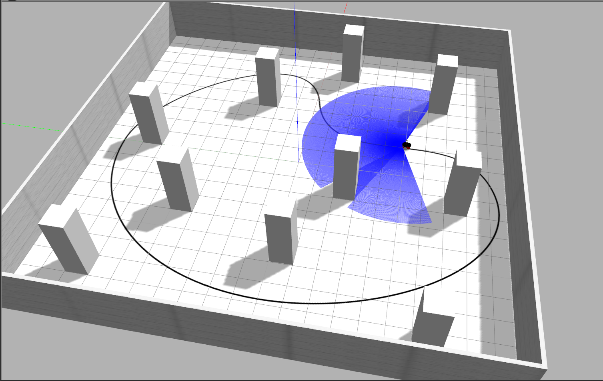

# Работа с виртуальным роботом
Данный файл подскажет вам как работать с текущим проектом,
позволяющим запустить робототехническую тележку pioneer 3dx в 
виртуальной среде.

Для корректной работы необходима библиотека расположенная в 
[данном](https://github.com/hircumg/robot_library) репозитории.

## Описание библиотеки

Для обеспечения работы робототехническое устройство 
использует библиотеку "robot",находящейся в 
[другом](https://github.com/hircumg/robot_library) репозитории
 и имеющей следующие команды:
1. **sleep(_sec_)** - пауза в sec секунд, возможно использование дробных чисел.
2. **getDirection()** - возвращает направление робота в диапазоне -179 -- 180
3. **getEncoders()** - возвращает показания экнодеров в радианах в формате dict
4. **getLaser()** - возвращает показания лазера, 
включая время кадра, угол лазера, изменение угла между соседними 
показаниями и сами показания в формате dict
5. **setVelosities(_linear, angular_)** - подасть 
заданные угловые и линейные скорости на робота
6. **getImage()** - возвращает изображение с 
камеры робота в формате OpenCV image


## Запуск примера

### Запуск полигона и необходимого окружения

Для запуска полигона и необходимого окружения
необходимо выполнить sh скрипт:
```
sh ~/catkin_ws/src/pioneer3dx_robot/sh/launch_example.sh
```
После некоторого времени на экране будет изображен робот в 
виртуальной среде. Примерно как на картинке ниже:



Данный полигон имеет размеры 20х20 метров. 
Каждая клетка 1х1 (является частью визуализации Gazebo, 
для робота её не существует).
На данном полигоне имеется нанесённая чёрная линия и препятствия
размером 1х1х3м

Также на полигоне присутствует дифференциальный робот с 
поворотным 3м колесом, pioneer 3dx, имеющий следующие параметры:
 - радиус колёс 0.09м, 
 - расстояние между центрами колёс 0.3м, 
 - удалённость 3го колеса от центра оси вращения 0.185м,
 - длина робота 0.345м. 
 - камера, с разрешением 800х800 
 - лазер с размахом 4,19 рад.

## Запуск примеров програм

Сейчас имеются несколько примеров работы:
 - Пример работы с камерой. Вывод изображения на экран.
```
python ~/catkin_ws/src/pioneer3dx_robot/scripts/camera_looking_example.py
```

 - Пример работы с камерой. Движение по линии.
```
python ~/catkin_ws/src/pioneer3dx_robot/scripts/camera_example.py
```

 - Пример работы с лазером. Объезд препятствий.
```
python ~/catkin_ws/src/pioneer3dx_robot/scripts/laser_example.py
```

 - Пример работы с экнодерами и ориетацией робота.
```
python ~/catkin_ws/src/pioneer3dx_robot/scripts/square_movement_example.py
```


