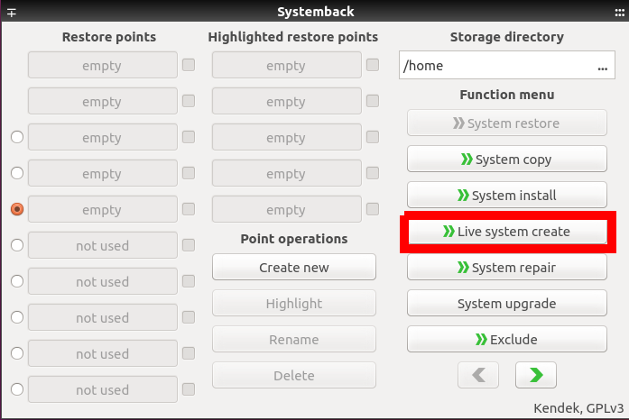
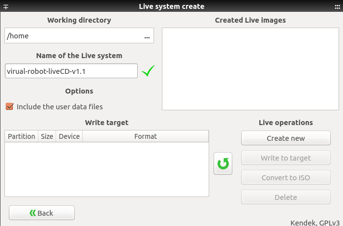
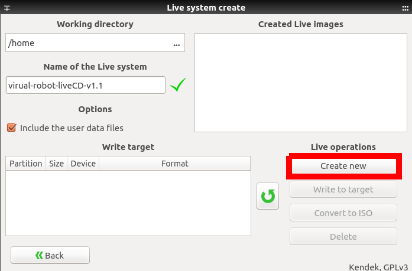
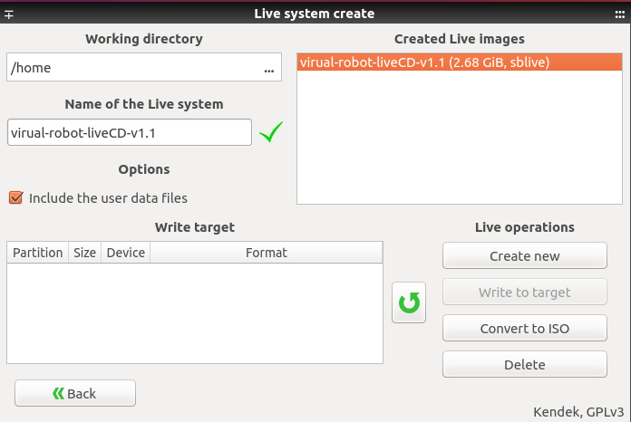

# Создание собственного образа системы

Для того чтобы создать собственный образ системы необходимо воспользоваться 
предустановленной программой "systemback".

1. Необходимо запустить программу.
    
2. На экране появится подобное окно

3. Неоходимо выбррать "Live system create"

4. После выбора будет отображено следующее окно.

Итак, разберём что есть что.
    1. путь, где будет находиться создаваемый образ
    2. имя создаваемого образа
    3. Включать или не включать данные пользователя. Необходимо включать 
    данные, так как в них находятся неоходимые файлы для работы с 
    роботом

5. После выбора названия образа, и остальных необходимых параметров 
необходимо нажать кнопку "Create new", для создания нового образа системы.

6. Через некоторое время, после того как образ системы будет создан, на 
экране будет следующее окно, в котором появится новая информация.

7. Чтобы создать iso образ неоходимо выбрать созданный образ и 
нажать кнопку "Convert to ISO"

8. Через некоторое время, после того как образ системы будет сконвертирован
до ISO формата, требуемый файл можно найти по выбранному пути. 
В примере "/home".